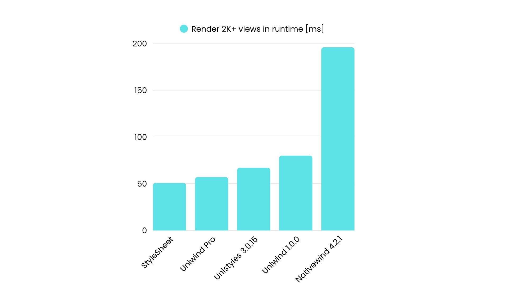
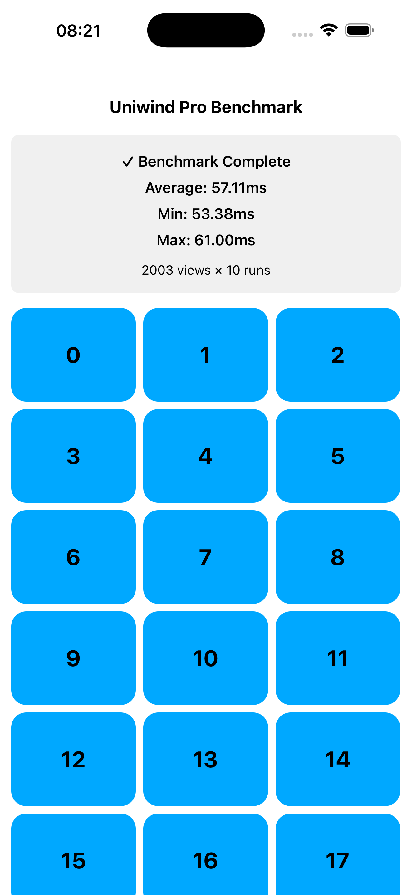

# Uniwind Benchmarks

Benchmark repository for different React Native styling libraries.



iPhone 17 Pro Max running iOS 26.0 in Release mode.
Result after opening the app for the second time (cached by the OS).

Uniwind and NativeWind use the exact same classNames.

It’s difficult to directly compare Unistyles, Uniwind, and Nativewind to StyleSheet, as it has no features, it only serves as a baseline for performance.

iOS

| Library | Time | 
| --- | --- | 
| StyleSheet | 49.74 | 
| Uniwind Pro beta | 57.11 | 
| Unistyles | 66.40 | 
| Uniwind | 81.36 | 
| NativeWind | 197.22 | 

Android

| Library | Time | 
| --- | --- | 
| StyleSheet | 60.78 | 
| Uniwind Pro beta | 71.19 | 
| Unistyles | 79.69 | 
| Uniwind | 94.14 | 
| NativeWind | 226.66 | 





## Repository Structure

```
uniwind-benchmarks/
├── apps/                    # React Native applications
│   ├── nativewind4/        # NativeWind v4 benchmark app
│   ├── stylesheet/         # React Native StyleSheet benchmark app
│   ├── unistyles3/         # Unistyles v3 benchmark app
│   ├── uniwind/            # Uniwind benchmark app
│   └── uniwind-pro/        # Uniwind Pro benchmark app
├── packages/
│   └── benchmark/          # Shared benchmark utilities
├── biome.json              # Biome configuration (linting + formatting)
├── tsconfig.json           # TypeScript configuration
└── package.json            # Workspace root configuration
```
